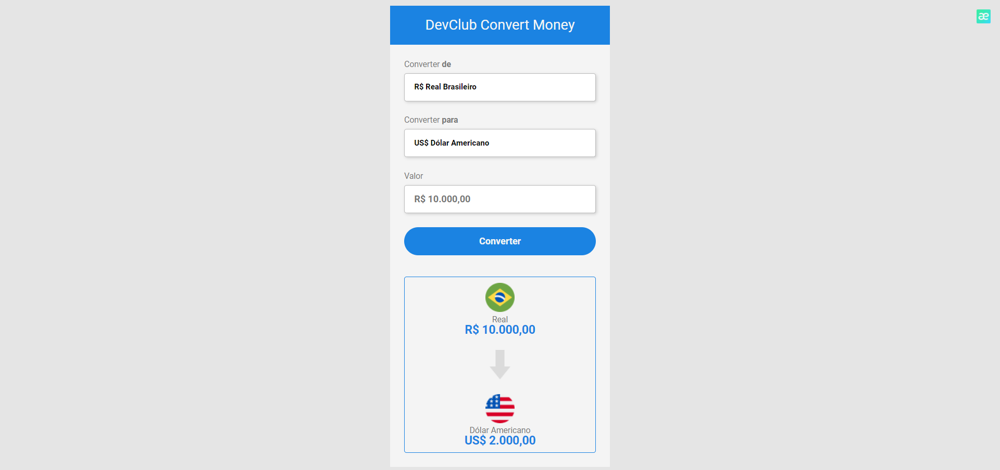
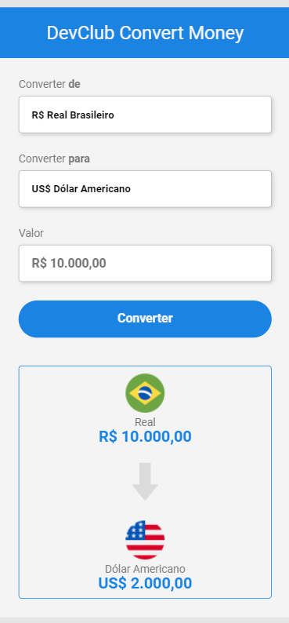

# Convert Money

 
 

> Currency converter. From Real to US Dollar, Euro, Bitcoin and Argentine Peso.

 
[Link do projeto](https://gui1703.github.io/Convert-Money/) - Project developed with HTML, CSS and JavaScript languages. Knowledge gained during DevClub classes.

## 🤝 Contributors.

We thank the following people who contributed to this project:

<table>
  <tr>
    <td align="center">
      <a href="#">
         
        
          <b>Guilherme Raposo</b>
        
      </a>
    </td>
  </tr>
</table>
 
 
